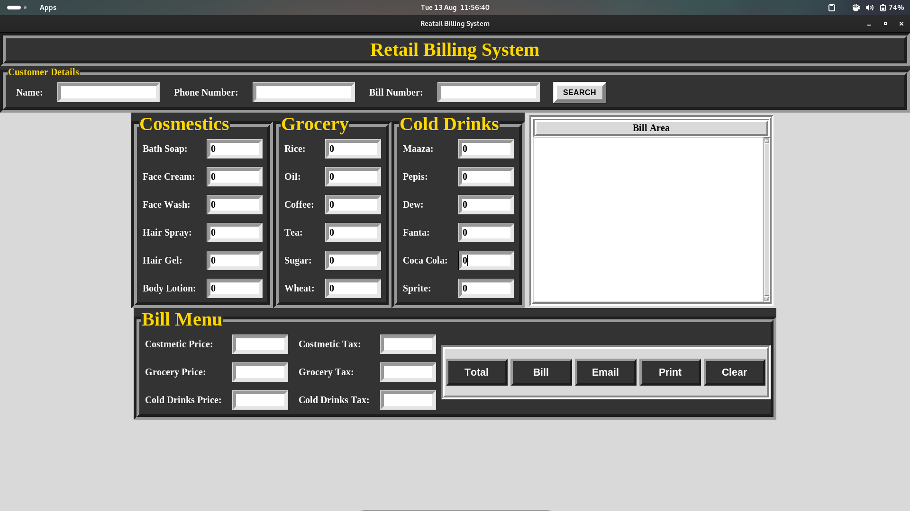

Billing System with Tkinter

This project is a graphical user interface (GUI) application built with Python's Tkinter library. The application is designed to manage billing tasks for a small store, allowing the user to input item quantities, calculate totals, print bills, save them to files, and send them via email. The application is also capable of handling bill searches and tax calculations.
Features

    Item Entry: Input fields for various cosmetic, grocery, and cold drink items.
    Total Calculation: Automatically calculates the total cost for each category (cosmetics, groceries, and cold drinks) including a configurable tax.
    Bill Display: Displays the itemized bill in a text area.
    Save Bill: Bills can be saved to the local file system.
    Search Bill: Allows users to search for a bill using the bill number.
    Print Bill: The bill can be printed directly from the application. The printing function is compatible with Windows, macOS, and Linux.
    Send Bill via Email: The bill can be sent to a recipient via email using Gmail's SMTP server.
    Clear Functionality: Resets all fields and the bill display area.

Requirements

    Python 3.x
    Tkinter (included with standard Python distribution)
    smtplib (included with standard Python distribution)
    A working printer for the print functionality
    An internet connection for sending emails

Installation

    Clone the repository:

    bash

git clone https://github.com/hollali/BillingSystem.git
cd BillingSystem

Run the application:

bash

    python BillingSystem.py

    Ensure you have an internet connection and a Gmail account configured for less secure apps if you intend to use the email functionality.

Usage
1. Item Entry

    Enter the quantity for each item in the respective entry fields. The prices are hardcoded in the application.

2. Calculating Totals

    Click on the "Total" button to calculate the total price for each category and the applicable tax.

3. Bill Display

    After calculating the totals, click on the "Generate Bill" button to display the itemized bill.

4. Saving the Bill

    Click on "Bill" to save the current bill to a text file in the bills directory. The file is named after the bill number.

5. Searching for a Bill

    Enter a bill number and click on "Search Bill" to retrieve a previously saved bill.

6. Printing the Bill

    Click on the "Print" button to print the bill. The application will attempt to use the default printer configured on your system.

7. Sending the Bill via Email

    Click on "Send Email" to open a new window where you can enter the sender's email, password, and recipient's email. The bill will be sent as the email content.

8. Clearing the Form

    Click on the "Clear" button to reset all input fields and clear the displayed bill.

Code Overview
Key Components

    clear(): Resets all the input fields and clears the bill display area.
    send_email(): Opens a new window for email input and sends the bill via Gmail SMTP.
    print_bill(): Prints the bill using the system's default printing service. Supports Windows, macOS, and Linux.
    search_bill(): Searches for and displays a previously saved bill based on the bill number.
    save_bill(): Saves the generated bill to the local file system.
    total(): Calculates the total cost for each category of items and the associated taxes.
    bill_area(): Generates and displays the itemized bill in the text area.

Directory Structure

bash

├── readme/README.md     # Documentation file
├── BillingSystem.py     # Main application file
└── bills/               # Directory where saved bills are stored

Dependencies

    Tkinter: For building the GUI.
    smtplib: For sending emails through Gmail's SMTP server.
    platform: To identify the operating system for printing compatibility.
    subprocess: To handle printing on Unix-like systems.
    os: For file handling and system operations.
    tempfile: For creating temporary files used in printing.

Customization

    Prices and Tax Rates: The prices of the items and tax rates are hardcoded in the total() function. These can be modified according to your requirements.
    Email Functionality: The email sender is configured for Gmail. If you want to use another email service, you'll need to update the SMTP server and port.

Troubleshooting

    Email Sending Issues: Ensure that your Gmail account is set up to allow less secure apps or use an app password if 2FA is enabled.
    Printing Issues: On macOS/Linux, ensure that the lpr command is available and properly configured.
    Bill Search Issues: Ensure that the bills directory exists and that bills are being saved correctly.

License

This project is open-source and available under the MIT License.